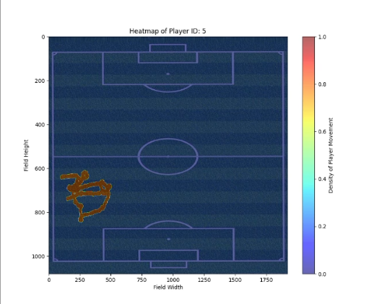

# ⚽ YOLOv8 Player Tracking with Heatmaps

<p align="center">
  
</p>

<p align="center">
  <a href="https://github.com/aligad12">
    
  </a>
  <a href="https://github.com/aligad12/YOLOv8-Player-Tracker/stargazers">
    
  </a>
</p>

---

## 🧠 Overview

This project leverages **YOLOv8** and **DeepSORT** to detect and track football players in match footage. It provides:

- 🎯 Real-time multi-player tracking  
- 🌡️ Heatmap generation to visualize player movement and spatial distribution  
- 🖥️ Intuitive GUI tools for interaction and visualization  
- 📊 Insights into player positioning and match performance  

---

## 🎥 Demo

<p align="center">
  
</p>

<p align="center">
  
</p>

---

## 📂 Project Structure & Script Overview

### 1. Heatmap Viewer GUI (`heatmap_viewer.py`)

**Purpose:**  
Provides a simple Tkinter GUI to visualize precomputed player heatmaps overlaid on a football pitch image.

**How it works:**  
- Loads heatmaps from a saved `.pkl` file, each corresponding to a player ID.  
- Displays a dropdown menu to select player IDs.  
- Shows a heatmap indicating where the player spent most time, over a football pitch background.  

**Usage Notes:**  
- Requires `player_heatmaps.pkl` generated by the tracking scripts.  
- Needs a local football pitch image file for background visualization.

---

### 2. Tracking with GUI & Heatmap Creation (`tracking_gui_heatmap.py`)

**Purpose:**  
Interactive real-time player detection, tracking, and heatmap updating with live GUI display.

**How it works:**  
- Reads football video frames.  
- Uses YOLOv8 for player detection and DeepSORT for tracking unique IDs across frames.  
- Updates heatmaps by marking detected player positions on a pitch grid.  
- Displays live video with bounding boxes and player IDs in a Tkinter GUI.  
- Allows filtering by player ID via dropdown.  
- Saves the annotated video and heatmaps on completion.

**Outputs:**  
- `tracked_players_outputvk.mp4` – annotated output video  
- `player_heatmaps.pklvk` – serialized heatmap data

---

### 3. Tracking & Heatmap Creation Without GUI (`tracking_no_gui.py`)

**Purpose:**  
Non-interactive, console-based script for batch processing videos to detect, track, and generate heatmaps.

**How it works:**  
- Processes the video frame-by-frame with YOLOv8 and DeepSORT.  
- Updates heatmaps for each tracked player position.  
- Draws bounding boxes and player IDs on frames.  
- Saves the processed video and heatmap data.

**Outputs:**  
- `tracked_players_outputmmm.mp4` – annotated video  
- `player_heatmaps.pkl` – heatmap data file

---

### 4. Tracking with GUI (Incomplete Frame Display) (`tracking_gui_incomplete.py`)

**Purpose:**  
Prototype script for tracking with GUI, but currently missing frame display functionality.

**How it works:**  
- Initializes tracking and GUI elements similar to script 2.  
- Processes frames but does not display video live in the GUI yet.  

**Usage:**  
- Useful as a base for adding live video frame rendering in Tkinter GUI.

**Output:**  
- `tracked_players_output.mp4` – processed video saved

---

## 🛠️ Tech Stack

| Area           | Tools Used           |
|----------------|---------------------|
| AI Model       | YOLOv8, Ultralytics  |
| Tracking       | DeepSORT            |
| GUI            | Tkinter             |
| Visualization  | Matplotlib, NumPy   |
| Video Handling | OpenCV              |
| Version Control| Git, GitHub         |

---

## 🚀 How to Run

1. Clone the repository:
   ```bash
   git clone https://github.com/aligad12/YOLOv8-Player-Tracker
   cd YOLOv8-Player-Tracker
